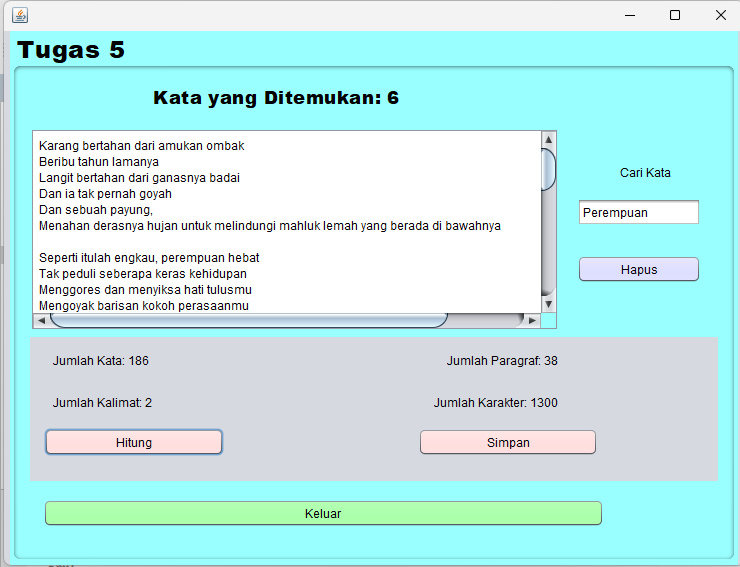

# Aplikasi Penghitung Kata
Aplikasi Penghitung Kata adalah aplikasi berbasis Java yang membantu pengguna menghitung jumlah kata, kalimat, karakter, serta frekuensi kata dalam sebuah teks. Selain itu, aplikasi ini mampu menampilkan informasi kata-kata yang paling sering digunakan dalam teks yang diinput.

# Keunggulan Aplikasi
Menghitung Jumlah Kata dan Kalimat: Aplikasi ini dapat menghitung jumlah kata dan kalimat dalam teks yang diberikan.
Menghitung Jumlah Karakter: Aplikasi menampilkan total karakter, baik dengan maupun tanpa spasi, sehingga pengguna bisa mendapatkan informasi yang lebih rinci.
Analisis Frekuensi Kata: Memberikan informasi mengenai frekuensi kemunculan setiap kata dalam teks, termasuk kata-kata yang paling sering digunakan.

# Pembuat Aplikasi
Tugas 5 - Muthya Adylla 2210010476 - 5C Reg Pagi BJM

# Fitur
Aplikasi ini menawarkan beberapa fitur utama:

1. *Penghitungan Jumlah Kata dan Kalimat*
Aplikasi menghitung jumlah kata dan kalimat dalam teks yang diinputkan, sehingga pengguna bisa dengan mudah mengetahui panjang dari teks tersebut.

2. *Penghitungan Jumlah Karakter*
Menampilkan total karakter, baik termasuk spasi maupun tidak, memberikan detail karakteristik teks secara keseluruhan.

3. *Analisis Frekuensi Kata*
Menganalisis dan menampilkan berapa kali setiap kata muncul dalam teks, membantu pengguna memahami pola penggunaan kata dalam teks yang lebih besar.

4. *Antarmuka Pengguna yang Sederhana dan Mudah*
Dengan antarmuka yang dibangun menggunakan Java, aplikasi ini mudah digunakan, memungkinkan pengguna untuk langsung memasukkan teks dan mendapatkan hasil analisis dengan cepat.

## Cara Menjalankan
1. Clone repositori ini ke dalam komputer Anda atau unduh sebagai ZIP.
2. Buka proyek di IDE pilihan Anda.
3. Pastikan Anda mengatur JDK yang benar di IDE Anda.
4. Jalankan PenghitungUmurFrame untuk memulai aplikasi.

# Demo

